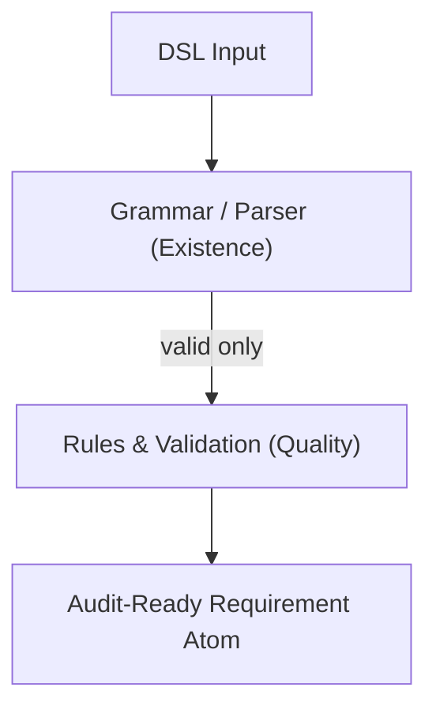

# Audit-by-Design DSL — DSL Core
**DSL Core** is the open standard specification that allows software requirements to be defined in a formal, revision-proof, machine-readable, and versioned manner — providing a deterministic and auditable foundation for regulated and trustworthy digital systems. 

By making requirements git versioned, explicit, verifiable, and traceable over time, DSL Core establishes the normative baseline against which implementations can be systematically audited.

---

## Rationale

**Trustworthy digital systems** must be built on validated requirements as a fundamental layer of every implementation. Software must be based on requirements that are consistently validated and free of contradictions.

Without formal semantics, requirements cannot be reliably validated.
Without reliable validation, security properties cannot be verified.
Without verifiability, trust cannot be established.

This is a matter of logical necessity.

## Architecture Overview


### **DSL core** is designed as a composable validation pipeline:

- **Parser** → transforms DSL input into a structured representation
- **Normalizer** → enforces atomicity and canonical form
- **Validator** → applies deterministic syntax and semantic rules
- **Report Generator** → produces machine-readable validation and audit output

Each component is designed to be usable independently or as part of automated toolchains.

---

## Purpose
This repository contains the **normative core implementation** of the Audit-by-Design DSL.

While the DSL specification defines *how requirements are expressed*, `dsl-core` defines **what is considered valid, consistent, and auditable**.

It provides the executable semantics required to:

- parse DSL statements
- validate syntax and structure
- enforce semantic and consistency rules
- normalize atomic requirements (AFOs)
- produce deterministic validation results
- serve as the technical reference for tooling, automation, and audits

This repository defines the **precondition under which secure and auditable software becomes possible**.

---

**DSL-Core** is an **open specification**, **free to use and extend**.
An open, formal, machine-readable, version-safe standard for requirements is one critical foundation for building secure and auditable systems.

for the **Audit-by-Design DSL**  - Human- and machine-readable **D**omain-**S**pecific **L**anguage (DSL) for *defining*, *validating*, and *auditing* atomic **requirements** (AFOs) in regulated software environments. 

**DSL core** is the  open standard that, for the first time, allows software requirements to be defined in a formal, revision-proof, machine-readable, and versioned manner — providing a deterministic and auditable foundation for regulated and trustworthy digital systems.


**DSL Core principles**

- DSL as a formal artifact → machine readability, deterministic validation, and auditability

- Git as the underlying infrastructure → proven, revision-safe versioning and traceability

- Open-source commitment → global interoperability and freedom from vendor lock-in

- Kerkhoff’s principle → transparency, traceability, and verifiability by design

## MVP-Based, Iterative Development

The DSL Core follows an **iterative, prototype-driven approach**.  
Each version of the parser, normalizer, and validator is treated as a **minimum viable prototype (MVP)**  
that must be functional, auditable, and testable before advancing to the next stage.

This iterative prototypical approach ensures:
- **Early validation** of syntax and semantics  
- **Transparent evolution** of the language and its rules  
- **Continuous feedback loops** between specification (`dsl-docs`) and implementation (`dsl-core`)  
- **Full traceability** from every change in grammar to its technical representation

## Core Scope and Evolution

The core evolves incrementally, following a minimal and strictly layered approach.
Each stage adds capabilities without changing the fundamental semantics of the DSL.

### Current focus

- Formal parsing of DSL artifacts
- Deterministic normalization of atomic requirements (AFOs)
- Structural and semantic validation
- Machine-readable validation and audit output

### Planned extensions

- CLI and API layers for toolchain integration
- CI/CD integration (e.g. GitHub Actions)
- Standardized audit report formats
- Reference adapters for downstream tooling

All extensions are required to preserve backward compatibility at the semantic level.
Breaking changes are treated as **standard revisions**, not refactorings.

## Relation to dsl-docs

The Audit-by-Design DSL is defined across two complementary repositories:

| Repository  | Responsibility |
|------------|----------------|
| `dsl-docs` | Human-readable specification of the DSL (concepts, grammar, semantics, rationale) |
| `dsl-core` | Machine-enforceable reference implementation (parsing, normalization, validation) |

The specification is **normative in text**.
`dsl-core` is **normative in execution**.

A requirement that is accepted by `dsl-core` is considered formally valid
according to the current version of the standard.


### Input (DSL)

## Example

The following example shows what the DSL core currently validates
based on the formally defined grammar and validation rules.

### Input (DSL)

```dsl
AFO REQ-001
AS System
I MUST validate authentication requests
```

👉 **Deterministic validation with reproducible output**

## Validation result (machine-readable and human readable)
```dsl 
{
  "id": "REQ-001",
  "type": "AFO",
  "status": "valid",
  "structure": {
    "actor": "System",
    "modal_verb": "MUST",
    "action": "validate authentication requests"
  },
  "validation": {
    "syntax": "ok",
    "atomicity": "ok",
    "ambiguity": "none",
    "contradictions": []
  }
}
```

### Example: invalid requirement

```json
AFO REQ-002
AS System
I SHOULD validate authentication requests and log user behavior

{
  "id": "REQ-002",
  "status": "invalid",
  "errors": [
    {
      "type": "atomicity_violation",
      "message": "Multiple actions detected in a single requirement"
    }
  ]
}
```
Note: 1) The requirement is rejected due to an atomicity violation. 2) Only binding modal verbs result in valid requirements. 

**DSL core validates requirements against a formally defined rule set (schema) and applies deterministic validation logic to identify structural, semantic, and normative violations.**

---

## Scope

`dsl-core` focuses exclusively on **requirements validation**, not on implementation.

In scope:
- formal parsing of DSL artifacts
- deterministic validation rules
- consistency and contradiction detection
- normalization of atomic requirements
- machine-verifiable audit outputs

Out of scope:
- application logic
- user interfaces
- security scanning of source code
- code generation
- runtime enforcement

---


## Typical Use Cases

- Validate requirements in CI/CD pipelines
- Detect contradictions before implementation starts
- Enforce atomicity and testability of requirements
- Generate reproducible audit evidence
- Support regulated software development (e.g. health, government, critical infrastructure)
- Constrain AI-generated requirements or acceptance criteria using formal rules

---

## Normative Grammar Rules

The DSL follows a two-layer model:

- **Layer A — Grammar / Parser (Existence):** decides whether a requirement exists in a valid, canonical form.
- **Layer B — Rules / Validation (Quality):** evaluates quality properties (e.g., atomicity, actor quality, binding modality) only after parsing succeeded.

### Canonical form (normative)

A requirement is canonical if it matches the following structure:


### Accepted input variants

For usability, the parser supports two equivalent input families:

1) **With role prefix (`As ...`) — subject is mandatory**

2) **Without role prefix — subject may be implicit**


### Rejected structures (non-normative)

The parser rejects ambiguous or incomplete structures, e.g.:

- Missing subject after an `As <Actor>,` prefix:

Rationale: Introducing a requirement with `As <Actor>,` must explicitly state the subject (`I` / `we`) to avoid implicit meaning and preserve deterministic auditability.


## Status

`dsl-core` is under active development and evolves alongside the DSL specification.

Breaking changes are treated as **standard changes**, not as refactorings, and are documented accordingly.

---

## Philosophy

> Requirements must be explicit before software can be trusted.  
> Validation must be automated before trust can scale.

---

## License

As of version v0.2.0, this project is licensed under the Apache License 2.0.
Previous releases (≤ v0.1.0) were published under Creative Commons BY 4.0.

For all new contributions and usage, the Apache 2.0 license applies.

© 2025 Sascha Block / Rock the Prototype
